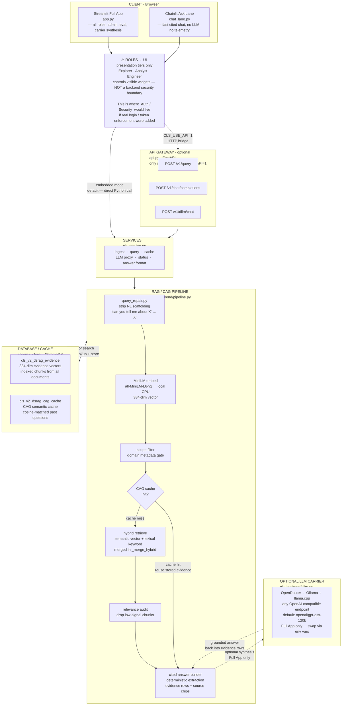

# CLS Synchrotron Research Query — Architecture (v1.2)

## Visual Architecture Map

> How the generic web-app layers map to **this** project, corrected for what actually exists.



**Reading the diagram:**

- Solid arrows `→` are the default embedded code path (no HTTP hop).
- Dashed arrows `-.->` are optional / conditional paths.
- The **Roles** box shows where `Auth / Security` *would* live; right now it only gates UI widgets, not backend data.
- The **API Gateway** box is skipped entirely in the default run; it activates only with `CLS_USE_API=1`.

---

## Product Shape

The app is a domain-specific RAG+CAG (dsRAG) implementation:

- **Indexing:** semantic sectioning with AutoContext patterns, embedded with `all-MiniLM-L6-v2` (sentence-transformers, offline CPU), stored in ChromaDB.
- **Research scopes:** metadata-gated retrieval across six disciplines (Chemistry, Computer Science, Biology, Physics, Mathematics, Literature).
- **Query repair:** natural-language scaffolding is stripped before embedding so verbose human phrasing maps to the same vector as the keyword form.
- **Hybrid retrieval:** semantic vector search always runs alongside a lexical keyword scan; results merge so exact-keyword hits are never lost.
- **Relevance audit:** second-pass filter that drops low-signal chunks before generation.
- **Query path:** repair the query → embed → optional scope filter → hybrid retrieve → CAG cache check → deterministic cited extraction → optional carrier synthesis.
- **Shared API:** same retrieval path exposed to Streamlit and OpenAI-compatible frontends.
- **Inference carrier:** when keyed, OpenRouter + `openai/gpt-oss-120b` synthesizes a direct answer from refined evidence rows (Full App only).

## Two UIs

| Surface | Entry | Visible controls |
| --- | --- | --- |
| Full App | Landing → "Full App" card | All roles, corpus admin, upload, precision controls, eval, evidence rows, optional carrier synthesis |
| Ask Lane | Landing → "Ask Lane" card | Bright llama.cui-style chat: scope selector, chat input, cited answer with source chips — no LLM, no engineering telemetry |

Both surfaces share the same retrieval backend. Session state keys are isolated (`lane_*` vs `last_*`) so switching between them is safe. The Ask Lane keeps a conversation history (`lane_messages`) and renders each turn as native chat bubbles with a source-chip row.

## Research Scopes

```python
RESEARCH_SCOPES = {
    "All disciplines":  None,
    "Chemistry":        {"domain": "chemistry"},
    "Computer Science": {"domain": "computer_science"},
    "Biology":          {"domain": "biology"},
    "Physics":          {"domain": "physics"},
    "Mathematics":      {"domain": "mathematics"},
    "Literature":       {"domain": "literature"},
}
```

`None` bypasses the Chroma metadata filter. Any other value is passed as `metadata_filter={"domain": "<value>"}` to the retrieval call. Documents are tagged at upload time with the matching domain string.

## Model Roles

| Component | Model | Required? | Why |
| --- | --- | --- | --- |
| Query / index embeddings | `all-MiniLM-L6-v2` (sentence-transformers) | Yes | Real semantic vectors, offline on CPU, ~80 MB one-time download |
| Relevance audit | `CLS_DLLM_MODEL` | Optional | Drop irrelevant chunks before synthesis |
| Inference carrier | `openai/gpt-oss-120b` (default) | Optional | Synthesizes grounded answer from evidence rows (Full App) |
| Carrier cleanup | `CLS_DLLM_MODEL` | Optional | Corrects PDF extraction artifacts; off by default |

The embedder downloads once to `~/.cache/huggingface/hub/`; after that it loads locally with no network. The launchers do not start Ollama and do not pull any LLM.

### Pluggable carrier

The carrier is any OpenAI-compatible `/v1/chat/completions` endpoint. Swap backends with env vars — no code change:

- **OpenRouter** (cloud, keyed): default `https://openrouter.ai/api/v1`.
- **llama.cpp** (local, offline): run `llama-server -m model.gguf --port 8080`, set `CLS_DLLM_API_URL=http://localhost:8080/v1`, unset the key.
- **Ollama** (local): point `CLS_DLLM_API_URL` at `http://localhost:11434/v1`.

## Runtime Layers

```text
Streamlit UI (Research Scopes)
  -> query repair (strip NL scaffolding)
  -> FastAPI bridge when CLS_USE_API=1, otherwise embedded cls_service
  -> SentenceTransformerEmbedder (all-MiniLM-L6-v2, local CPU)
  -> Metadata Filter (domain scope)
  -> CAG Layer (SemanticEvidenceCache)
  -> Hybrid retrieve on cache miss: semantic vector + lexical keyword, merged (ChromaDB)
  -> Relevance Audit (optional)
  -> deterministic answer builder
  -> optional inference carrier synthesis (Full App)
  -> optional carrier cleanup (extraction artifacts only)
```

`/v1/chat/completions` exposes two model routes:

- `cls-rag-cag-v1.0`: local RAG/CAG extraction.
- `CLS_DLLM_MODEL`: proxy to the configured external inference carrier.

`/v1/dllm/chat` is the direct carrier proxy used by Streamlit synthesis, relevance audit, and cleanup.

## Hybrid Retrieval

`instant_answer` always runs both retrievers and merges them in `_merge_hybrid`:

- **Semantic** (`retrieve`): MiniLM vector search — handles paraphrase and messy natural language.
- **Lexical** (`lexical_retrieve`): term-overlap keyword scan — catches an exact keyword the encoder ranked low.
- **Merge:** semantic scores win on chunks both retrievers return; lexical-only hits are appended as a safety net, then truncated to `top_k`.

If the embedder is unavailable, retrieval degrades cleanly to lexical-only (`retrieval_mode = "lexical_fallback"`).

## Query Repair

`cls_backend/query_repair.py::repair_query` strips conversational scaffolding before embedding — "can you tell me about the X-ray energy range" → "X-ray energy range". It runs on every query in `query_backend`. `TYPO_REPLACEMENTS` and `QUERY_EXPANSIONS` are empty hooks for deployment-specific acronym repair.

## CAG Layer

The CAG Layer (`cls_backend/cag_cache.py`, `SemanticEvidenceCache`) is a second ChromaDB collection keyed by the embedding of a past question.

- **Lookup:** question is encoded by MiniLM and matched against the cache with a cosine threshold. With a real semantic encoder, the cache now generalises across paraphrases, not just near-identical strings.
- **Reuse granularity:** evidence rows only. A hit reuses stored evidence while the deterministic answer builder re-runs.
- **Invalidation:** every entry stores a `corpus_sig` derived from Evidence Store source hashes. Re-indexing makes stale cache entries unreachable.

## Evidence Store

Collection names are in `cls_config.py`:

- `cls_v2_dsrag_evidence` — indexed evidence chunks (384d, MiniLM).
- `cls_v2_dsrag_cag_cache` — cached query-to-evidence rows (384d, MiniLM).

> **Migration note (v1.1 → v1.2):** the encoder changed from a 768d hash to 384d MiniLM, so the collections were renamed `v1` → `v2`. The old `cls_v1_*` collections are no longer queried. Use **Reset Chroma index** in the admin sidebar and re-index to build the v2 store.

### Document readers

`cls_backend/readers.py` normalises extraction across formats so the rest of the pipeline stays document-type-agnostic. Supported formats:

- PDF (`pymupdf`)
- Plain text / Markdown
- DOCX (`python-docx`, small pure-Python dependency)
- HTML / HTM (stdlib parser, strips script/style/nav/footer/header)
- CSV / TSV (stdlib, each row becomes a pseudo-page with header context)
- JSON (stdlib, flattened and paginated)

All readers return `(page_number, text)` tuples; chunking, embedding, and indexing are unchanged.

## Performance Notes

For a 7 MB / 100-page PDF on CPU:

| Step | Typical time |
| --- | --- |
| PDF extraction | a few seconds |
| Chunking | under a second |
| MiniLM embedding (first call) | a few seconds (model load) |
| MiniLM embedding (warm) | well under a second |
| Chroma storage | under a few seconds |

The inference carrier runs only after retrieval; it has no effect on indexing speed.

## Design Philosophy

- Retrieval is instant and primary (DocuSearch-inspired).
- The Ask Lane is built for speed first: instant cited extraction, with an optional tiny local parrot (Qwen 2.5 0.5B via Ollama/llama.cpp) that rephrases evidence and is guarded by a deterministic relation-drift check.
- The deterministic cited extraction is always shown; carrier synthesis is a downstream Full-App option.
- The prototype favors inspectable local retrieval: every evidence row is visible and auditable.
- Carrier cleanup is downstream, optional, guarded, and API-only.
